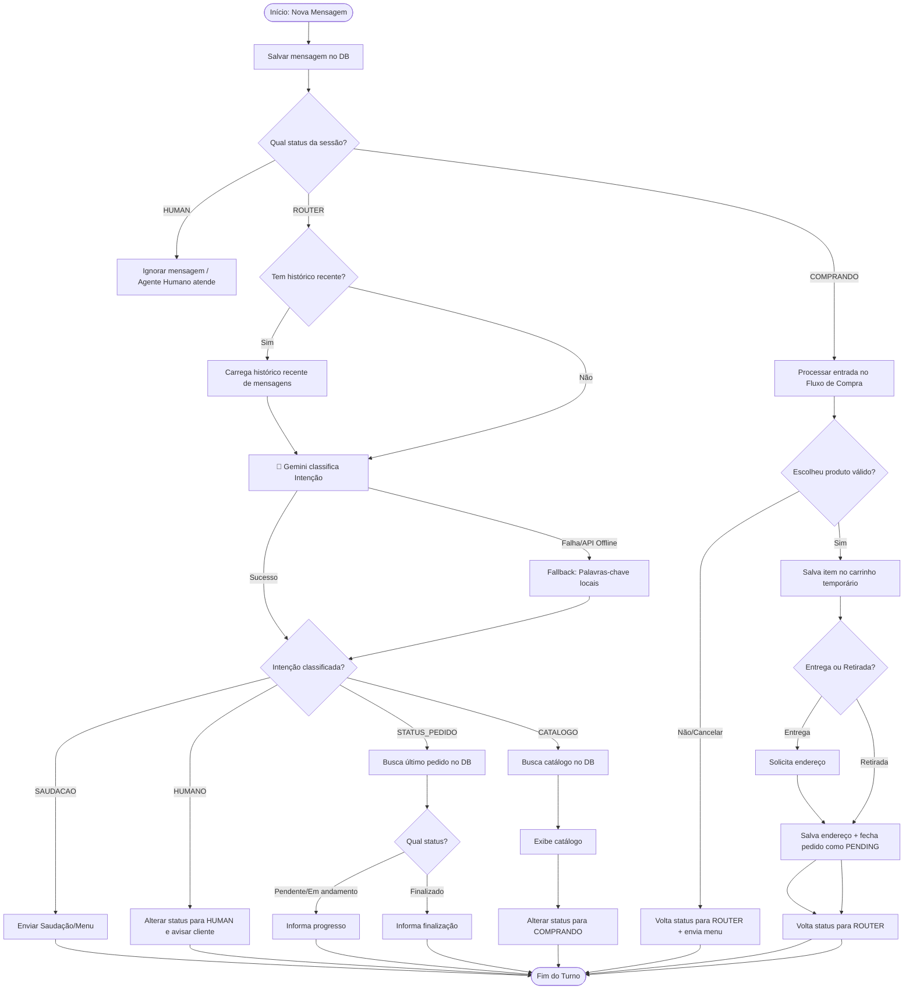

# Plano de Implementação — Algoritmo Completo & Personalização (Rei das Orquídeas)

Este plano foi personalizado para o seu potencial cliente **O Rei das Orquídeas** (floricultura especializada em atacado e varejo) e detalha o roteiro de desenvolvimento educativo para você aprender o processo ponta a ponta.

---

## 🌸 Personalização para "O Rei das Orquídeas"

Para impressionar o cliente com o MVP, vamos adaptar os dados de exemplo para produtos florais reais:

1. **Orquídea Phalaenopsis Branca** (SKU: `ORQ-PHA-BR`) — R$ 99,90
2. **Cesta Cascata Pink (3 hastes)** (SKU: `CES-CAS-PK`) — R$ 249,90
3. **Muda de Orquídea Denphal** (SKU: `MUD-DEN-01`) — R$ 29,90
4. **Adubo Orgânico Especial Bokashi** (SKU: `ADU-BOK-01`) — R$ 35,00

Também ajustaremos as palavras-chave de busca para corresponder a esse catálogo em [CheckStockUseCase.ts](file:///c:/Users/vixto/Documents/Projetos/Chatbot-whatssap/Chatbot-whatssap/src/modules/estoque/CheckStockUseCase.ts).

---

## 🛠️ Ordem Correta de Construção do MVP (Roteiro Educativo)

Para construir um software profissional de forma organizada e limpa, seguimos uma abordagem **Database-First + UseCase-Driven** (de dentro para fora). Aqui está a ordem exata do que faremos e o porquê:

### 1. Modelagem do Banco (Database Layer)
* **O que fazemos**: Alterar o arquivo [schema.prisma](file:///c:/Users/vixto/Documents/Projetos/Chatbot-whatssap/Chatbot-whatssap/prisma/schema.prisma) para adicionar as tabelas de `Message` (Histórico) e os campos de estado em `ChatSession`.
* **Por que começar aqui**: O banco de dados define o formato dos dados que nossa aplicação vai manipular. Sem saber como salvamos os dados, fica difícil escrever a lógica de negócios.
* **Ferramenta**: Rodar as migrations para aplicar as alterações no PostgreSQL local.

### 2. Dados de Teste (Seeding)
* **O que fazemos**: Atualizar o script de [seed.ts](file:///c:/Users/vixto/Documents/Projetos/Chatbot-whatssap/Chatbot-whatssap/prisma/seed.ts) com os produtos reais de orquídeas e rodar o comando de seed.
* **Por que**: Precisamos de dados reais no banco para testar nossas consultas sem ter que cadastrar tudo manualmente toda vez.

### 3. Regras de Negócio (Camada Domain/UseCases)
* **O que fazemos**: Escrever os Casos de Uso (`UseCases`) isolados do WhatsApp:
  * `SaveMessageUseCase` (Salva histórico)
  * `CheckStockUseCase` (Personalizado para plantas)
  * `CreateOrderUseCase` (Registra o pedido no DB)
* **Por que**: Regras de negócio devem ser "puras", ou seja, não devem depender de detalhes externos como o WhatsApp ou a API do Gemini. Elas recebem dados, processam no banco e retornam a resposta.

### 4. Inteligência Artificial (Intention Classifier)
* **O que fazemos**: Criar a classe que chama o Gemini (com seu token da API) e enviar o histórico de conversas do cliente para classificar a intenção.
* **Por que**: Agora que a lógica do banco e os use cases existem, a IA pode decidir com precisão qual use case chamar com base na conversa.

### 5. Integração com WhatsApp (Infra Layer)
* **O que fazemos**: Conectar tudo no [WhatssapProvider.ts](file:///c:/Users/vixto/Documents/Projetos/Chatbot-whatssap/Chatbot-whatssap/src/infra/providers/WhatssapProvider.ts). Quando uma mensagem chegar via Baileys:
  1. Chama o banco para ver a sessão.
  2. Roteia usando IA ou Máquina de Estados.
  3. Devolve a resposta estruturada para o celular do cliente.

---

## 📐 O Fluxo Completo do Algoritmo



---

## 🗄️ Ajustes de Banco de Dados (Prisma)

```prisma
// Chatbot-whatssap/prisma/schema.prisma

model ChatSession {
  id            String    @id @default(uuid())
  customerPhone String    @unique
  status        String    @default("ROUTER") // ROUTER, COMPRANDO, HUMAN
  checkoutStep  String    @default("NONE")   // NONE, AGUARDANDO_PRODUTO, AGUARDANDO_ENTREGA, AGUARDANDO_ENDERECO
  currentOrderId String?                     // Armazena o ID do pedido ativo durante a compra
  createdAt     DateTime  @default(now())
  orders        Order[]
  messages      Message[]
}

model Message {
  id            String      @id @default(uuid())
  chatSessionId String
  chatSession   ChatSession @relation(fields: [chatSessionId], references: [id])
  sender        String      // "USER" ou "BOT"
  text          String
  createdAt     DateTime    @default(now())
}
```

---

## 🔮 Plano de Verificação

### Testes Automatizados
- Executar scripts de teste unitário isolados para a IA (`RouteIntentUseCase.spec.ts`) validando os retornos do Gemini para diferentes frases.
- Testar a máquina de estados salvando dados falsos no DB e simulando as respostas do cliente.

### Verificação Manual
- Enviar mensagens reais no WhatsApp em cada status e certificar-se de que o bot responde adequadamente.

